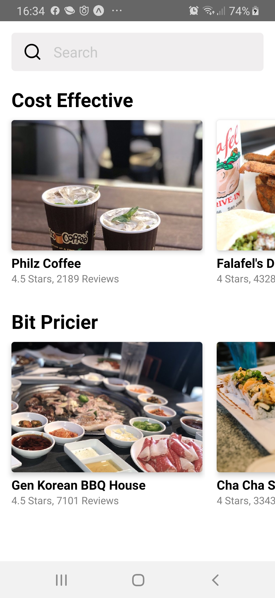
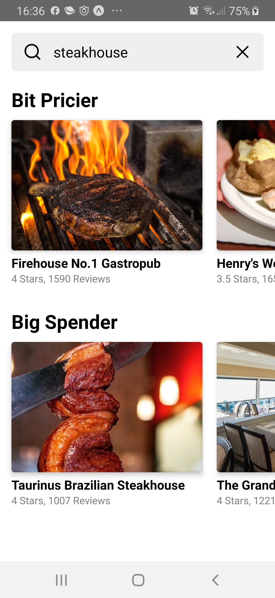
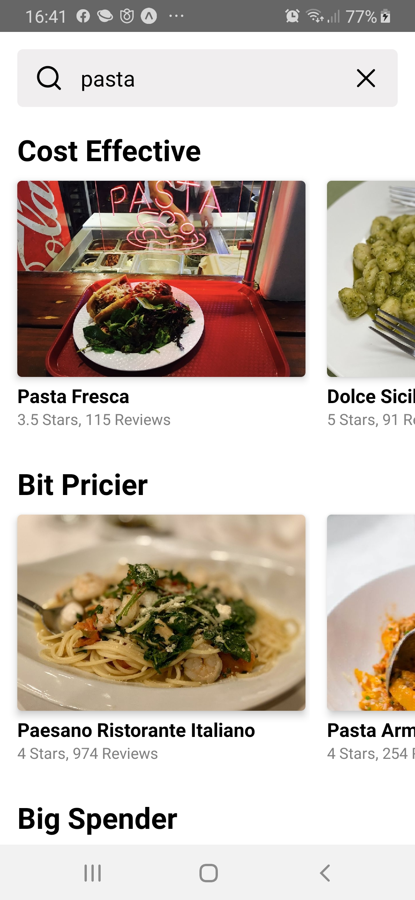
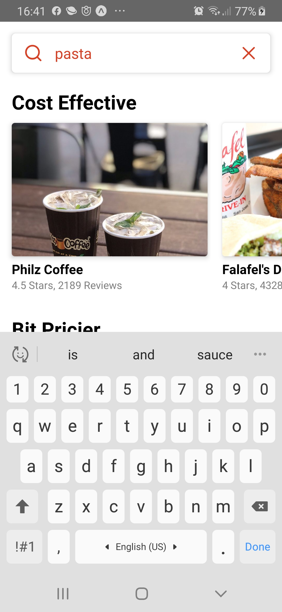
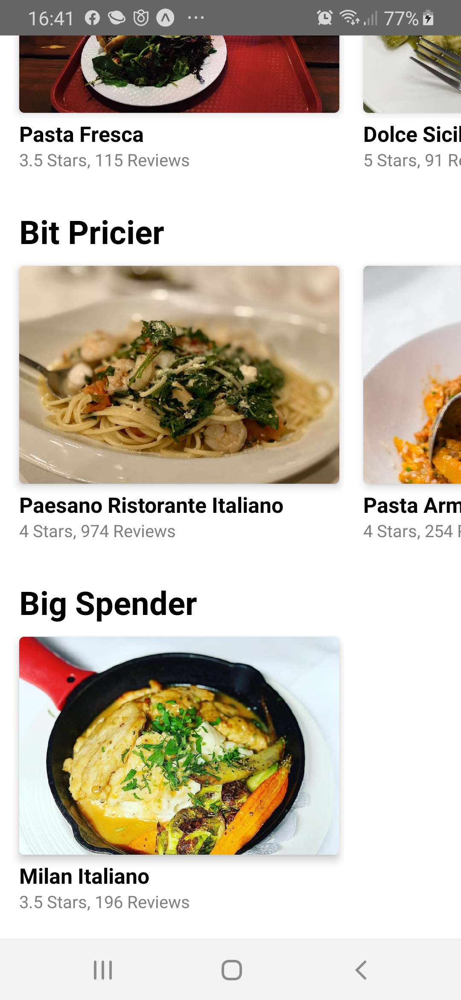

# food-search
React Native app for food and businesses search using yelp api. 

<strong>Demo Screenshots:</strong>

<div>
  
  
  
</div>

<br><br>
<div>
  
  
  
</div>

<br><br>
<div>
  
</div>

## Getting Started

These instructions will get you a copy of the project up and running on your local machine for development and testing purposes.

### Prerequisites

You can either clone or download this repo, then go to project dir and install dependecies

```
npm install
```

Then install expo dependencies

```
expo install react-native-gesture-handler react-native-reanimated react-native-screens react-native-safe-area-context @react-native-community/masked-view
```

#### To be able to make requests to yelp api you have to generate your own key by creating an account to their [website](https://www.yelp.com/fusion) and click "Get Started" button

* Once you get your key, create a file in root directory named 'yelp-api.keys.js'.
* File should look like this: ```export const API_KEY = "YOUR API KEY GOES HERE"```

### And your good to go!
